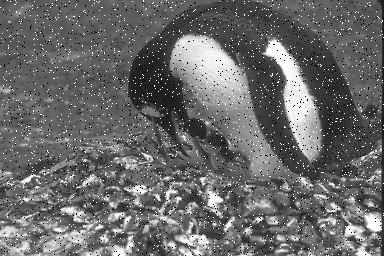
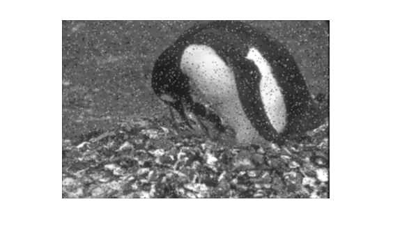

# Image Manipulation - Basic Functions 01


*Create by Joniel B Barreto on September 6th, 2018*


*Copyright (c) 2018 jonielbarreto. All rights reserved.*


# Low Pass Filter


Smoothing filters, or low-pass filters, are commonly used for noise removal. This algorithm presents the averaging, weighted averaging and median filters.


**Clear memory and windows command**


```matlab:Code
clear
close all
clc
```


**Read image for tests**


Image with “salt and pepper” noises


```matlab:Code
f = imread('noise1.png');
figure('Name','Original Image')
imshow(f)
```





**Mask size**


The filter mask size can change the result a lot, because the larger the mask size, the greater its ability to remove noise, on the other hand, the image becomes more blurred and this can interfere with the image interpretation.


```matlab:Code
num = input('Enter a number (odd above 1) for mask size NxN\n');
while (mod(num,2) ~= 1) || (num <=1)
    num = input('Invalid number, try again. Enter a number (odd above 1)\n');
end
```


**Averaging filter**


```matlab:Code
filt1 = fspecial('average',num);    % Create predefined 2-D filter
image_f1 = imfilter(f,filt1);
figure('Name','Averaging filter');
imshow(image_f1)
```


**Weighted averaging filter**


```matlab:Code
% Create a mask with a cross with higher values
mat = ones(num, num);
for i = 1:num
    for j = 1:num
        if ((i == fix(num/2)+1) || (j == fix(num/2)+1))
            mat(i,j) = 2;
        end
        if ((i == fix(num/2)+1) && (j == fix(num/2)+1))
            mat(i,j) = 4;
        end
    end
end

mat = (1/sum(sum(mat)))*mat;

image_f2 = imfilter(f,mat);
figure('Name','Weighted averaging filter')
imshow(image_f2)
```





**Median filter**


```matlab:Code
image_f2 = medfilt2(f,[num num]);
figure('Name','Median filter')
imshow(image_f2)
```


